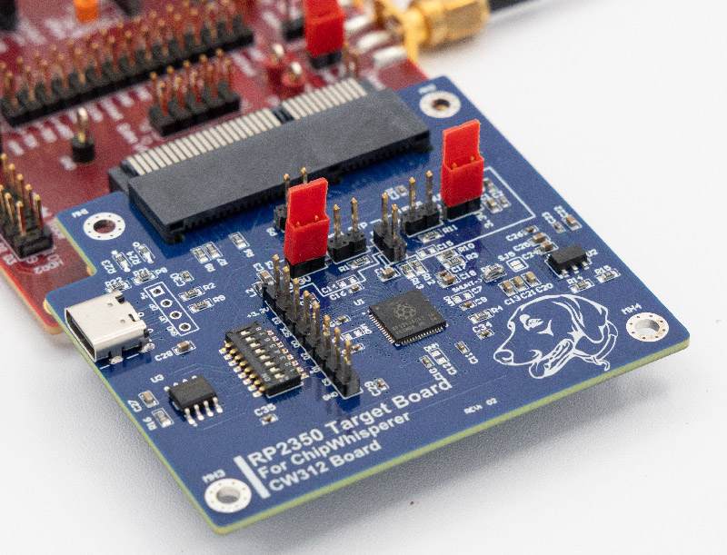

# CW312T-RP2350

This board supports the Raspberry Pi RP2350 microcontroller. It especially lets you experiment with features such as power analysis or fault injection, including testing the glitch detectors.



---

## Specifications

| Feature | Notes/Range |
|---------|----------|
| Target Device | RP2350 |
| Target Architecture | Arm & RISC-V |
| Vcc | 1.0V (on-board LDO) |
| Programming | Bootloader |
| Hardware Crypto | No |
| Availability | Standalone |
| Status | Released |
| Shunt | TBD |


## Power Supply

The RP2350 has an internal regulator. This regulator is not
used in the board, instead power for the core is supplied by an external
LDO on the board.

---

## Programming

The USB bootloader can be used by enabling the 12 MHz clock source. To program, do the following:

1. Run `scope.default_setup()`
1. Set `scope.clock.clkgen_freq = 12E6`
1. Set PDIC low and `time.sleep(0.5)`
1. Set NRST low and `time.sleep(0.5)`
1. Set NRST to high-z (`scope.io.nrst = None`) and `time.sleep(0.5)`
1. Set PDIC to high-z

Following this, a removable drive should appear, after which your generated UF2 file can be copied over. Your RP2350
will reboot and run your firmware.

The drive can be found in Python via the following code, requiring the `wmi` package on Windows:

```python
def get_windows_drive_letter(self):
    import wmi
    letter = None
    c = wmi.WMI()
    for drive in c.Win32_LogicalDisk():
        # uncomment to print info of all connected drives
        #print(str(drive))
        #print(str(drive.Caption) + str(drive.VolumeName) + str(drive.DriveType))
        if drive.VolumeName == "RP2350":
            letter = drive.Caption
    return letter

def linux_get_rpi_path(self):
    import subprocess
    result = subprocess.run(['blkid', '-l', '-o', 'device', '-t', 
                            'LABEL=RP2350', '-c', '/dev/null'],
                            capture_output=True)
    mnt = result.stdout.decode().strip()
    result = subprocess.run(['findmnt', mnt, '-no', 'TARGET'], capture_output=True)
    return result.stdout.decode().strip()
```

### Troubleshooting

#### Drive appears, then disappears before programming

Try increasing the `time.sleep()` delays

---

## Schematic

The schematic is available [here](https://github.com/newaetech/chipwhisperer-target-cw308t/blob/main/CW312T_RP2350/RP2350_CW312_REV02.PDF).

---

## Board Layout

See [GIT Repo](https://github.com/newaetech/chipwhisperer-target-cw308t/tree/main/CW312T_RP2350) for gerber files.
